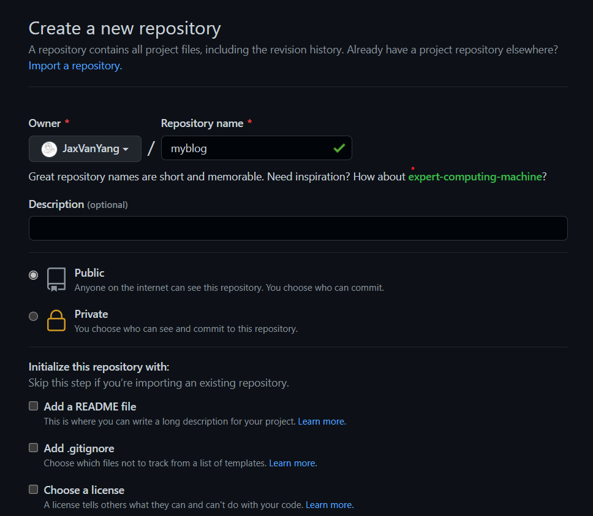
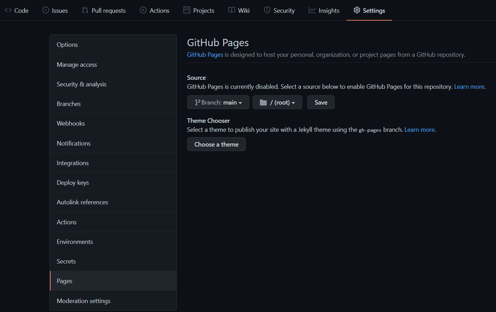

# Just Call Me Jax

This is the repository for my [blog](https://jaxvanyang.github.io).

## Configure Dev Environment

1. Install Ruby and other prerequisites:

    ```shell
    # Ubuntu
    sudo apt install ruby-full build-essential zlib1g-dev
    ```

    ```shell
    # ArchLinux
    sudo pacman -S --needed ruby base-devel
    ```

2. Configure RubyGems packages(called gems) to be installed in a folder under your home directory:

    ```shell
    echo '# Install Ruby Gems to ~/.gems' >> ~/.bashrc
    echo 'export GEM_HOME="$HOME/.gems"' >> ~/.bashrc
    echo 'export PATH="$HOME/.gems/bin:$PATH"' >> ~/.bashrc
    source ~/.bashrc
    ```

    or manually write the following lines in your .bashrc(or .zshrc, etc) file and execute `source ~/.bashrc`:

    ```shell
    # Install Ruby Gems to ~/.gems
    export GEM_HOME="$HOME/.gems"
    export PATH="$HOME/.gems/bin:$PATH"
    ```

3. 更改 RubyGems 为国内镜像源：

    ```shell
    gem sources --add https://gems.ruby-china.com/ --remove https://rubygems.org/

    # 更改 bundle 的源代码镜像（安装完 bundler 后再执行）
    bundle config mirror.https://rubygems.org https://gems.ruby-china.com
    ```

    确保只有 gems.ruby-china.com

    ```console
    $ gem sources -l
    https://gems.ruby-china.com
    ```

4. Install Jekyll and Bundler(they are gems):

    ```shell
    gem install jekyll bundler
    ```

    If you use Ruby 3.0(maybe you use ArchLinux), you may see the following WARNING:

    ```shell
    WARNING:  You don't have /home/jax/.local/share/gem/ruby/3.0.0/bin in your PATH,
          gem executables will not run.
    ```

    Then just add it to your PATH:

    ```shell
    # ~/.bashrc
    export PATH="$HOME/.local/share/gem/ruby/3.0.0/bin:$PATH"
    ```

5. Add webrick if you use Ruby 3.0 or later:

    ```shell
    gem add webrick
    ```

## Quick Setup

1. Create an empty directory or use an existing one:

    ```shell
    mkdir -p ~/blog
    cd ~/blog
    ```

2. Initialize a new Jekyll site in an empty directory:

    ```shell
    jekyll new .
    ```

    or use an existing directory:

    ```shell
    jekyll new . --force
    ```

3. Test your site:

    ```shell
    bundle exec jekyll serve
    ```

4. Look around your site directory:

    ```console
    $ ls -l
    404.html  Gemfile  Gemfile.lock  README.md  _config.yml  _posts  _site  about.markdown  index.markdown
    ```

## Blogging

1. Check out this first: https://jekyllrb.com/docs/step-by-step/08-blogging/

2. Create new posts in [_posts](_posts) under your site directory.

## Deploy on GitHub Pages

1. Create a new empty repository on GitHub:

    

2. Initialize the local repository and push it to Github:

    ```shell
    git init
    git add .
    git commit -m "first commit"
    git branch -M main
    git remote add origin <your_repo_url>
    git push -u origin main
    ```

3. Activate Github Pages

    
    
## Reference

- [Jekyll on Ubuntu](https://jekyllrb.com/docs/installation/ubuntu)

- <https://gems.ruby-china.com>

- <https://jekyllrb.com/docs>

- <https://www.youtube.com/watch?v=EvYs1idcGnM&list=PLWzwUIYZpnJuT0sH4BN56P5oWTdHJiTNq>